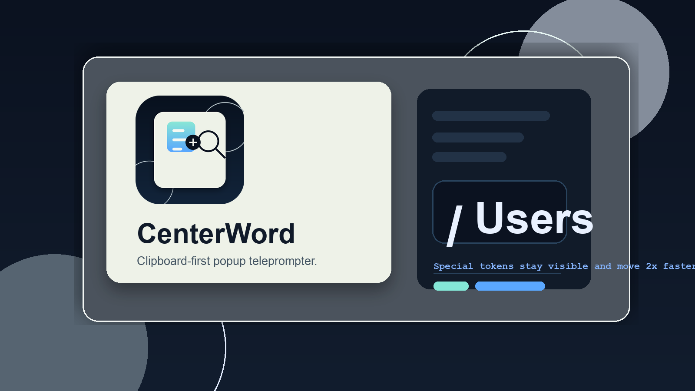

# CenterWord

<p align="center">
  
</p>

<p align="center">
  A clipboard-to-teleprompter macOS app. Copy text, hit <code>Cmd+Option+S</code>, and a focused reader jumps to the front.
</p>

<p align="center">
  
  
  
  
</p>

CenterWord exists for one job: take text you already copied and put it into a fast, minimal popup reader without making you switch context or fight a big dashboard.

## Goal

- Copy text from anywhere on macOS.
- Press `Cmd+Option+S`.
- Get an instant teleprompter-style popup that starts reading immediately.

The main app still exists for editing text, testing speeds, and adjusting appearance, but the product is built around the popup flow.

## Install

### Option 1: Download the app

Download the latest release from GitHub:

- [Latest Releases](https://github.com/nickita-khylkouski/centerword/releases/latest)

Release assets include:

- a signed `.app` bundle zipped for direct install
- a signed `.dmg` for drag-and-drop install

### Option 2: Install from npm

```bash
npx centerword-app
```

That installer downloads the latest release and installs `CenterWord.app` into:

```text
~/Applications/CenterWord.app
```

### Option 3: Build locally

```bash
git clone https://github.com/nickita-khylkouski/centerword.git
cd centerword
./scripts/install-app.sh release
```

## First Run

CenterWord is clipboard-first. The shipped shortcut flow only needs **Input Monitoring** so macOS will let the app detect `Cmd+Option+S` globally.

First-run checklist:

1. Open CenterWord once.
2. Grant **Input Monitoring** when prompted.
3. Copy text.
4. Press `Cmd+Option+S`.

If the popup ever does not appear, the full app still opens normally and shows the shortcut status.

## What Makes It Useful

- Popup teleprompter comes to the front and starts automatically
- Popup is resizable and remembers the size you leave it at
- Popup closes itself about a second after the final token
- Main window still supports paste, edit, start, pause, restart, and seek
- Saved default WPM is reused for the global shortcut flow

## Token Behavior

CenterWord intentionally keeps separators visible instead of collapsing them away.

Examples:

- `hello-hello` becomes `hello`, `-`, `hello`
- `/Users/nickita/Applications/CenterWord.app` becomes `/`, `Users`, `/`, `nickita`, `/`, `Applications`, `/`, `CenterWord`, `.`, `app`
- `don't` stays `don't`

Separator tokens such as `/`, `-`, `+`, `_`, and `.` still show up, but they move at **2x speed** so paths and structured strings stay readable without feeling slow.

## Local Development

Run from source:

```bash
swift run CenterWord
```

Run tests:

```bash
swift test
```

Build release artifacts:

```bash
./scripts/package-release.sh
```

## Project Layout

```text
centerword/
├── AppBundle/
├── Assets/Brand/
├── Sources/CenterWordApp/
├── Tests/CenterWordTests/
├── npm/
└── scripts/
```
