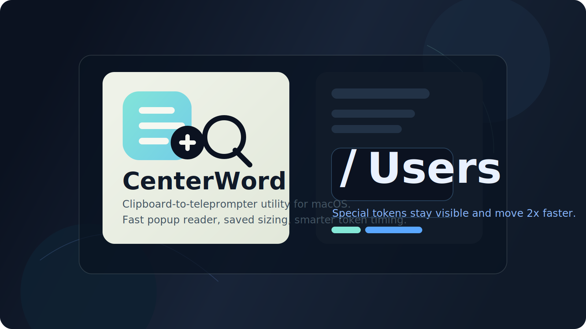

# CenterWord

<p align="center">
  
</p>

<p align="center">
  Clipboard-to-teleprompter utility for macOS.
</p>

<p align="center">
  
  
  
</p>

CenterWord turns clipboard text into a floating teleprompter. Copy anything, press `Cmd+Option+S`, and a focused reader pops over your current app, starts playing immediately, remembers its size, and closes itself after the last token.

## What It Does

- Pops a floating teleprompter over your current workspace
- Reads the latest clipboard text at your saved default WPM
- Keeps punctuation and separators as visible tokens
- Speeds separators like `/`, `-`, `+`, `_`, and `.` to 2x playback
- Lets you resize the popup and remembers that size
- Auto-closes about a second after the final token
- Still includes a full main app window for paste/edit/start/pause/restart control

## Main Flows

### Clipboard Teleprompter

1. Copy any text.
2. Press `Cmd+Option+S`.
3. CenterWord opens the floating reader and starts playback.

### Main App

1. Paste or type long text into the editor.
2. Set your WPM.
3. Press `Start`.
4. Use `Pause`, `Restart`, `Back 5s`, or `Forward 5s`.

## Token Rules

CenterWord does not throw away path and punctuation separators anymore.

Examples:

- `hello-hello` becomes `hello`, `-`, `hello`
- `/Users/nickita/Applications/CenterWord.app` becomes `/`, `Users`, `/`, `nickita`, `/`, `Applications`, `/`, `CenterWord`, `.`, `app`
- `don't` stays `don't`

Kept inside words:

- letters
- numbers
- `'`
- `’`

Shown as their own tokens:

- `/`
- `\`
- `-`
- `+`
- `_`
- `.`
- `,`
- `|`
- `:`
- `;`
- `(`
- `)`
- `[`
- `]`
- `{`
- `}`
- `<`
- `>`
- `!`
- `?`
- `@`
- `#`
- `$`
- `%`
- `^`
- `&`
- `*`
- `=`

## Local Development

Run from source:

```bash
cd /Users/nickita/centerword
swift run CenterWord
```

Run tests:

```bash
cd /Users/nickita/centerword
swift test
```

Install the signed app locally:

```bash
cd /Users/nickita/centerword
./scripts/install-app.sh
```

That installs to:

```text
/Users/$USER/Applications/CenterWord.app
```

## Project Layout

```text
centerword/
├── AppBundle/
├── Assets/
│   └── Brand/
├── Sources/CenterWordApp/
├── Tests/CenterWordTests/
└── scripts/
```
